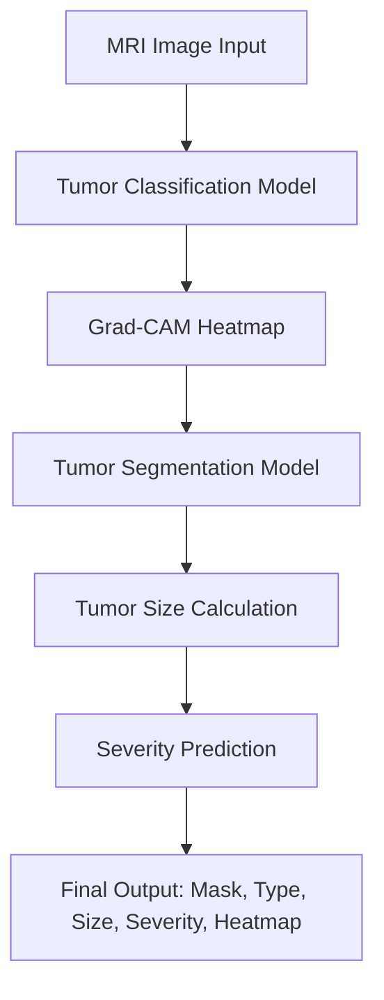

<div align="center">
  <h1>🧠 NeuroX</h1>
  <h3>AI-Based Brain Tumor Detection, Segmentation, and Severity Analysis System</h3>
  
  
  
  
</div>

---

## 📖 Table of Contents
- [1. Project Overview & Motivation](#1-project-overview--motivation)
- [2. Datasets Used](#2-datasets-used)
- [3. System Architecture](#3-system-architecture)
- [4. Deep Learning Models](#4-deep-learning-models)
  - [Tumor Classification (EfficientNet-B0)](#tumor-classification-efficientnet-b0)
  - [Explainable AI (Grad-CAM)](#explainable-ai-grad-cam)
  - [Tumor Segmentation (U-Net)](#tumor-segmentation-u-net)
- [5. Tumor Size & Severity Prediction](#5-tumor-size--severity-prediction)
- [6. Challenges & System Optimization](#6-challenges--system-optimization)
- [7. Setup & Installation ⚙️](#7-setup--installation-️)
- [8. Academic & Evaluation Materials 🎓](#8-academic--evaluation-materials-)
  - [Capstone Project Proposal](#capstone-project-proposal)
  - [Top 10 Viva Questions & Answers](#top-10-viva-questions--answers)
  - [10-Slide Presentation Structure](#10-slide-presentation-structure)

---

## 1. Project Overview & Motivation

**NeuroX** is an AI-powered medical imaging system designed to analyze brain MRI scans, detect tumors, and provide comprehensive clinical insights. The system performs five major tasks:
1. **Tumor Detection**
2. **Tumor Classification**
3. **Tumor Segmentation**
4. **Tumor Size Estimation**
5. **Tumor Severity Prediction**

### Motivation
Brain tumors are notoriously difficult to detect manually. MRI scans contain massive volumes of data, tumor boundaries are often unclear, and accurate diagnosis requires highly trained radiologists, which can be affected by fatigue or experience levels. 
Our goal is to build an artificial intelligence diagnostic assistant to automatically detect tumors, highlight suspicious regions, estimate size, and predict severity—accelerating diagnosis and assisting medical professionals.

---

## 2. Datasets Used

We utilized two specialized public datasets for training the deep learning models:

| Task | Dataset | Details | Purpose |
|------|---------|---------|---------|
| **Classification** | [Kaggle Brain Tumor MRI Dataset](https://www.kaggle.com/) | ~7000 MRI images.<br>Classes: Glioma, Meningioma, Pituitary tumor, No tumor | Classifying tumor types |
| **Segmentation** | [BraTS 2020](https://www.med.upenn.edu/cbica/brats2020/) | 371 Patients.<br>Modalities: FLAIR, T1, T1CE, T2 | Pinpointing exact tumor boundaries using expert-labeled masks |

---

## 3. System Architecture

NeuroX relies on an end-to-end multi-model pipeline:



---

## 4. Deep Learning Models

### Tumor Classification (EfficientNet-B0)
A Convolutional Neural Network (CNN) specifically chosen for medical images because it detects spatial patterns and extracts visual features accurately while requiring fewer parameters and less memory due to compound scaling.
- **Activation Function:** ReLU (hidden layers), Softmax (output layer for probabilities).
- **Loss Function:** Cross Entropy Loss.
- **Hyperparameters:** Learning Rate: `0.001`, Optimizer: `Adam`, Batch Size: `32`, Epochs: `20`, Image Size: `224×224`, Dropout: `0.2`.
- **Test Accuracy:** **`95.68%`**

### Explainable AI (Grad-CAM)
Deep learning in medicine must be trustworthy. We integrated **Grad-CAM** (Gradient-weighted Class Activation Mapping) to generate heatmaps highlighting *where* the neural network focused its attention when making a classification decision, ensuring transparency.

### Tumor Segmentation (U-Net)
For pinpointing the exact boundary of the tumor, we combined U-Net with a **ResNet34 Encoder**. U-Net perfectly captures local/global context using skip connections, and ResNet provides deep residual learning capabilities.
- **Loss Function:** Dice + Binary Cross Entropy.
- **Hyperparameters:** Learning Rate: `0.0001`, Optimizer: `AdamW`, Batch Size: `8`, Epochs: `20`.
- **Performance Evaluation:** Dice Score 
- **Dice Score Achieved:** **`0.956`** (meaning 95.6% overlap between predicted and actual tumor regions).

---

## 5. Tumor Size & Severity Prediction

Once the tumor is segmented, the binary mask is used to calculate approximate area:
> **Tumor Size** = Number of tumor pixels × Scaling factor

**Severity Rules:**
- **Low Severity:** Small tumor (Size < 10)
- **Medium Severity:** Medium tumor (10 – 40)
- **High Severity:** Large tumor (Size > 40)

---

## 6. Challenges & System Optimization

| Challenge | Solution Implemented |
|-----------|--------------------|
| **Dataset Imbalance** | Data augmentation and balanced training classes. |
| **Training Instability (Overfitting)** | Implemented learning rate schedulers and dropout layers. |
| **High Computation Cost** | Used lightweight architectures (EfficientNet-B0) & Mixed Precision Training. |
| **Model Explainability** | Added Grad-CAM visualizations to ensure interpretability. |

---

## 7. Setup & Installation ⚙️

**Prerequisites:** Python 3.9+, Node.js (v18+), Git.

### 1️⃣ Backend Setup (FastAPI & PyTorch)
Navigate to the backend directory and install the Python dependencies.

```bash
cd backend

# Create a virtual environment (optional but recommended)
python -m venv venv
# On Windows
venv\Scripts\activate
# On macOS/Linux
source venv/bin/activate

# Install requirements
pip install -r requirements.txt

# Run the FastAPI server
uvicorn app:app --reload --port 8000
```
> The API will be available at `http://localhost:8000`. You can test endpoints via Swagger UI at `http://localhost:8000/docs`.

### 2️⃣ Frontend Setup (Next.js)
Open a new terminal, navigate to the frontend directory, install npm packages, and start the development server.

```bash
cd frontend

# Install dependencies
npm install

# Run the Next.js development server
npm run dev
```
> The web interface will be available at `http://localhost:3000`. 
> Make sure the Python backend is actively running concurrently to process image uploads!

---

## 8. Academic & Evaluation Materials 🎓

<details>
<summary>📄 <b>Click to View: Deep Learning Lab Capstone Project Proposal</b></summary>
<br>

**Project Title:** NeuroX: AI-Based Brain Tumor Detection, Segmentation, and Severity Analysis Using Deep Learning  
**Student Name:** Krishna Shonka  
**Department:** Computer Science and Electronics  
**Course:** Deep Learning Lab  
**Institution:** Ramdeobaba University  

### 1. Motivation
Brain tumors are serious neurological disorders. While MRI scans offer high-resolution imagery, analyzing them manually is highly time-consuming, requires high expertise, and is susceptible to human fatigue and variability. Deep Learning (CNNs) has proven remarkably successful in automating spatial feature extraction in medical scans. **NeuroX** aims to design an intelligent, reliable system to detect, classify, segment, and evaluate the severity of brain tumors.

### 2. Problem Statement
**How to design an AI-based deep learning system that can accurately detect brain tumors from MRI images, classify the tumor type, identify the tumor region, and estimate tumor severity in an automated and efficient manner?**
Traditional tools rely heavily on expert thresholds that vary among patients. Deep neural architectures bypass this by learning complex intrinsic patterns if properly structured and trained.

### 3. Objectives
1. Develop an AI model to detect the presence of tumors in MRI imagery.
2. Classify tumors into: Glioma, Meningioma, Pituitary tumor, or No tumor.
3. Highlight exact tumor boundaries through automatic image segmentation.
4. Estimate pixel-based tumor size.
5. Project tumor severity based on the measured size.
6. Provide explainability using Grad-CAM heatmaps.
7. Integrate an easy-to-use user interface.

### 4. Methodology
1. **Data Collection:** Kaggle Brain Tumor Classification dataset & BraTS 2020 Segmentation dataset.
2. **Preprocessing:** Resizing to 224x224, pixel normalization (0-1 range), tensor conversion.
3. **Classification:** Employing **EfficientNet-B0**.
4. **Explainable AI:** Computing gradient-weighted class activation mapping (Grad-CAM).
5. **Segmentation:** Employing **U-Net** coupled with a ResNet34 encoder.
6. **Size Estimation:** Pixel counting × scaling multipliers.
7. **Severity Routing:** Mapping computed sizes to standard Low/Medium/High metrics.
8. **System Integration:** FastAPI + Next.js orchestration.

### 5. Expected Outcomes
High-accuracy Deep Learning models for tumor classification & segmentation. An end-to-end, visual AI diagnostic assistant to streamline radiology evaluations. Explainable visual cues to build trust in clinical environments.

### 6. Dataset Used
- Brain Tumor MRI Dataset (Kaggle)
- BraTS 2020 Dataset (Brain Tumor Segmentation Challenge)

### 7. References
1. Ronneberger, O. et al. (2015). U-Net: Convolutional Networks for Biomedical Image Segmentation.
2. Tan, M., & Le, Q. (2019). EfficientNet.
3. Selvaraju, R. R. et al. (2017). Grad-CAM.
4. BraTS Challenge / Kaggle Brain Tumor datasets.
</details>

<details>
<summary>🎤 <b>Click to View: Top 10 Viva Questions & Best Answers</b></summary>
<br>

1. **Why did you use Deep Learning instead of traditional Machine Learning algorithms like SVM or Random Forest?**
   *Answer:* Medical image analysis requires extracting deep spatial and structural features. Traditional ML struggles with complex feature extraction natively and requires manual feature engineering. CNNs (Deep Learning) automatically learn specialized filters (edges, textures) that are far more accurate for tasks like identifying unclear tumor boundaries.

2. **Why EfficientNet-B0 specifically over ResNet or VGG for classification?**
   *Answer:* EfficientNet utilizes "Compound Scaling," intelligently balancing the depth, width, and resolution of the network. This allowed us to achieve high accuracy (95.68%) with significantly fewer parameters than older architectures like VGG16, ensuring faster training and lower memory overhead.

3. **What is Grad-CAM and why is it essential in a medical context?**
   *Answer:* Grad-CAM stands for Gradient-weighted Class Activation Mapping. It visualizes the areas of an image that had the greatest impact on the CNN's final prediction. In healthcare, doctors cannot blindly trust a "black box" AI. Grad-CAM provides necessary interpretability, proving that the model actually looked at the tumor logic rather than background noise.

4. **Can you explain the U-Net architecture you used for segmentation?**
   *Answer:* U-Net is a CNN built to create segmentation masks. It has a symmetrical U-shape containing an **Encoder** (downsampling path to capture context/features) and a **Decoder** (upsampling path to precisely localize those features). The defining feature of U-Net is its **Skip Connections**, which pass spatial information directly from the encoder to the decoder, saving fine details lost during compression.

5. **Why did you use ResNet34 as an encoder for U-Net?**
   *Answer:* Standard U-Net encoders are relatively shallow. By swapping the standard encoder with ResNet34, we leveraged "residual blocks." These blocks use skip connections internally to prevent the vanishing gradient problem, allowing the network to robustly learn much deeper features without training degradation. 

6. **What is a Dice Score? Why didn't you just use standard "Accuracy" for segmentation?**
   *Answer:* In medical segmentation, the tumor area is usually very small compared to the black background (background class imbalance). Standard accuracy would be 90%+ even if the model just guessed "completely black." The **Dice Score** explicitly measures the spatial overlap (Intersection over Union equivalent) between the predicted tumor mask and the ground truth mask, giving a true measure of segmentation accuracy.

7. **How does the ReLU activation function solve the Vanishing Gradient problem compared to Sigmoid or Tanh?**
   *Answer:* Sigmoid and Tanh functions "squash" incoming values into a narrow output range (0 to 1, or -1 to 1). The gradients of these functions approach zero for extreme inputs, causing the network to stop learning in deep layers. ReLU simply outputs $f(x) = \max(0, x)$, preserving a gradient of $1$ for all positive inputs, ensuring gradients flow freely backwards through deep layers.

8. **How do you calculate Tumor Severity? Is this calculation clinically valid?**
   *Answer:* We currently estimate severity strictly geometrically by measuring the size (counting segmented tumor pixels × scaling factor). While an excellent heuristic for a tech prototype (Small=Low, Medium=Medium, Large=High severity), true clinical severity (e.g., Grade IV Glioblastoma) also depends on tumor shape, growth rate, and necrosis—which could be a future scope of this project.

9. **What were the biggest challenges faced during this project?**
   *Answer:* A major challenge was dealing with data imbalance in the Kaggle dataset. Second was model overfitting. We solved these using Data Augmentation techniques, Dropout layers (randomly dropping 20% of neurons to prevent co-adaptation), and tweaking our learning schedules.

10. **What is the backend and frontend stack and how do they communicate?**
    *Answer:* The backend is built using Python's **FastAPI** because it offers high performance and asynchronous request handling, which is crucial for processing heavy machine learning tensor operations. The frontend is built on **Next.js**. They communicate via RESTful HTTP POST requests, where the Next.js app sends the MRI image via standard `multipart/form-data`, and FastAPI returns JSON containing the predicted class, Grad-CAM, and segmented mask points.
</details>

<details>
<summary>📊 <b>Click to View: Recommended 10-Slide PPT Structure</b></summary>
<br>

If you are converting this project to a PowerPoint presentation, follow this 10-slide blueprint for maximum impact:

1. **Title Slide:** NeuroX: AI-Based Brain Tumor Detection & Analysis / Your Name & Dept.
2. **Introduction & Motivation:** Why is manual tumor detection hard? The goal of automating discovery.
3. **Problem Statement:** Current medical imaging challenges and how Deep Learning solves spatial pattern extraction natively.
4. **Datasets Utilized:** Showcase Kaggle (Classification) and BraTS 2020 (Segmentation) details. Include sample images.
5. **System Architecture (Flowchart):** Visual flowchart from Image Input $\rightarrow$ CNN $\rightarrow$ Grad-CAM $\rightarrow$ U-Net $\rightarrow$ Output Analytics.
6. **Task 1: Classification & Interpretability:** Talk about EfficientNet-B0 (95.68% acc) and showcase Grad-CAM heatmaps.
7. **Task 2: Segmentation:** Explain U-Net architecture (+ ResNet34) and the Dice Score (95.6%). Show a segmented output.
8. **Task 3: Severity Prediction:** Explain how tumor masks are analyzed to extract size and classify severity buckets.
9. **Tech Stack & Deployment:** Frontend (Next.js), Backend (FastAPI, PyTorch), highlighting system speed.
10. **Conclusion & Future Scope:** Summarize success and point toward 3D Volumes and clinical deployment.
</details>

<br>
<div align="center">
  <sub>Developed by Krishna Shonka for D Capstone Project | Ramdeobaba University</sub>
</div>
